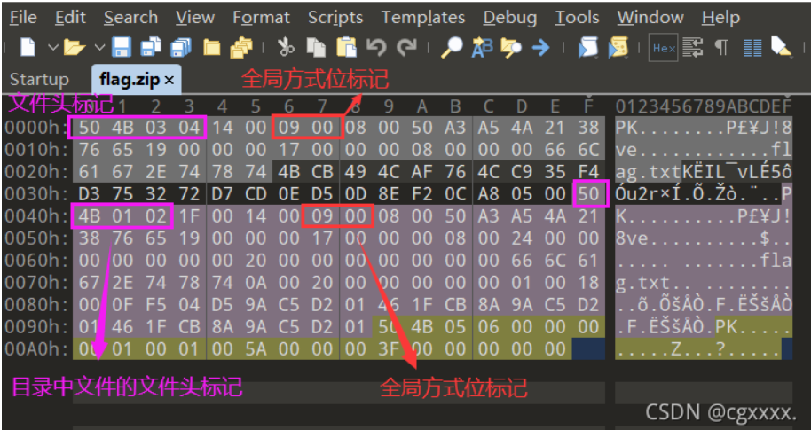

## music 

wirehark查找登录请求使用http.request.method==POST

# 伪加密

未加密：

文件头中的全局方式位标记为00 00

 目录中源文件的全局方式位标记为00 00

伪加密：

文件头中的全局方式位标记为00 00

目录中源文件的全局方式位标记为09 00

真加密：

文件头中的全局方式位标记为09 00

目录中源文件的全局方式位标记为09 00

ps:也不一定要09 00或00 00，只要是奇数都视为加密，而偶数则视为未加密
