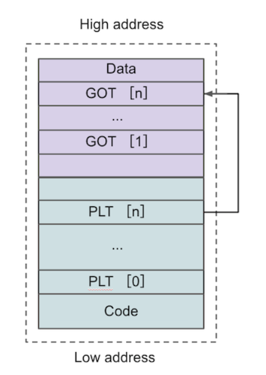
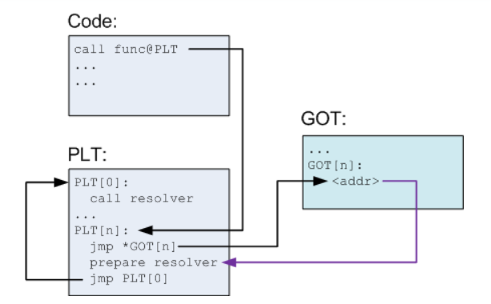
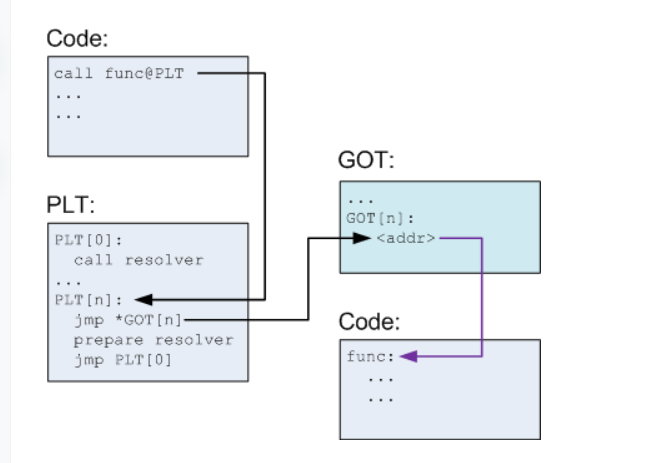

# Pwn 

## 不懂的函数
### memset(s, 0, sizeof(s))的作用

memset(s, 0, sizeof(s))是 C/C++ 语言中的一个函数调用，它的作用是：
功能说明

​​将内存区域清零​​：将指针 s指向的内存区域的每个字节都设置为 0

​​范围确定​​：操作的内存大小由 sizeof(s)决定

​​初始化作用​​：常用于初始化变量或清空数据缓冲

###  setvbuf(stdout, 0, 2, 0);是 C 语言中用于设置标准输出流（stdout）缓冲模式的函数调用。

函数原型
```c
int setvbuf(FILE *stream, char *buffer, int mode, size_t size);
```
参数解释

stdout: 标准输出流（通常是屏幕输出）

0: 表示不提供自定义缓冲区，让系统自动分配

2: 缓冲模式，这里的 2对应 _IONBF（无缓冲）

0: 缓冲区大小（由于选择了无缓冲模式，此参数被忽略）

具体作用

这行代码将标准输出设置为​​无缓冲模式​​（unbuffered），这意味着：

​​立即输出​​：所有写入 stdout 的输出会立即显示，不会等待缓冲区填满或遇到换行符

​​实时性​​：在需要实时显示输出的场景中特别有用

​​调试友好​​：在调试程序时，可以确保输出信息及时显示，即使程序崩溃也能看到之前的输出

## 汇编语言
>一个指令，一个或两个操作数

两个操作数时：一个目标操作数，一个原操作数 eg:mov  rbp,rsp   将rsp的值赋值到rbp上
                                           movq %rsp,%rbp  rbp=rsp
add表示加，sub表示减 xor异或 call调用函数 ，movzx将后面赋值到前
lea：Load effective address lea rax，[rbp-0x18]   #rax=[rbp-0x18]
xor: xor ebx,ebx  #使ebx=0，有影响标志寄存器的副作用，mov没有 
cmp:al,0x61 #al-0x61
sub:al,0x61 #al=al-0x61
test eax,eax 就是 eax&eax 可以看作 cmp eax,0

0-255
8       16     32     64
BYTE    WORD   DWORD  QWORD

>PLT和GOT
GOT 全称是全局偏移量表（Global Offset Table），用来存储外部函数在内存的确切地址。GOT 存储在数据段（Data Segment）内，可以在程序运行中被修改。
PLT 全称是程序链接表（Procedure Linkage Table），用来存储外部函数的入口点（entry），换言之程序总会到 PLT 这里寻找外部函数的地址。PLT 存储在代码
内，在运行之前就已经确定并且不会被修改，所以 PLT 并不会知道程序运行时动态链接库被加载的确切位置。
所以，PLT表内存储的就是 GOT 表中对应条目的地址。
全局偏移量表（GOT）

全局偏移量表（GOT）是一个在程序的数据段中的表，它存储了程序中所有需要动态链接的函数和变量的地址。当程序第一次调用一个动态链接的函数时，动态链接器会查找该函数在动态链接库中的地址，然后将这个地址存储在GOT表中的相应条目中。这样，当程序再次调用这个函数时，它就可以直接从GOT表中获取这个函数的地址，而不需要再次进行查找。
程序链接表（PLT）

程序链接表（PLT）是一个在程序的代码段中的表，它包含了一系列的跳转指令，这些指令用于跳转到GOT表中的相应条目。当程序需要调用一个动态链接的函数时，它会首先跳转到PLT表中的相应条目，然后通过这个条目跳转到GOT表中的相应条目，最后跳转到这个函数在动态链接库中的实际地址。

Code Segment）

当第一次调用这个外部函数，程序会通过 GOT 表再次跳转回 PLT 表，运行地址解析程序来确定函数的确切地址，并用其覆盖掉 GOT 表的初始值，之后再执行函数调用。



第二次调用这个外部函数时，程序仍然首先通过 PLT 表跳转到 GOT 表，此时 GOT 表已经存有获取函数的内存地址，所以会直接跳转到函数所在地址执行函数。



Ropgadget --binary filename --only "pop|ret"

[堆漏洞](https://ctf-wiki.org/pwn/linux/user-mode/heap/ptmalloc2/fastbin-attack/#_1
)


objdump -t XXX               查看程序中使用到的函数
objdump -d XXX               查看程序中函数的汇编代码
objdump -d -M intel XXX      查看程序中函数的汇编代码，并且汇编代码是intel架构的
objdump -d -j .plt XXX       查看plt表
           -j的参数有：.text  代码段
                      .const 只读数据段（有些编译器不使用此段，将只读数据并入.data段）
                      .data  读写数据段
                      .bss   bss段